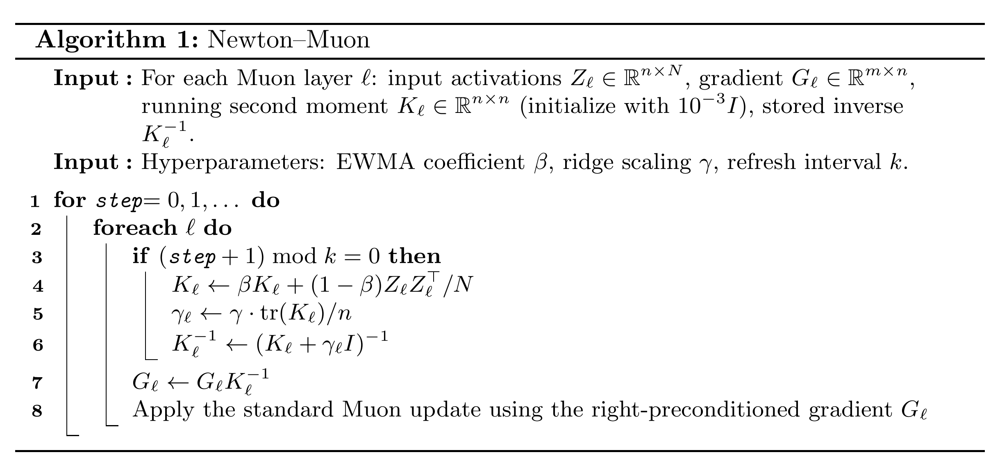
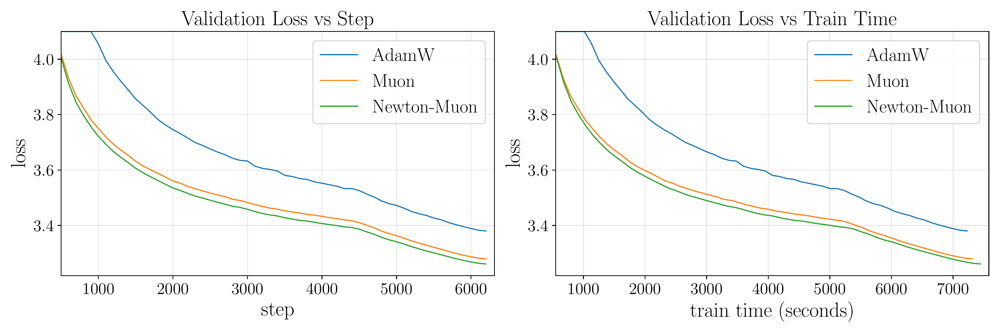
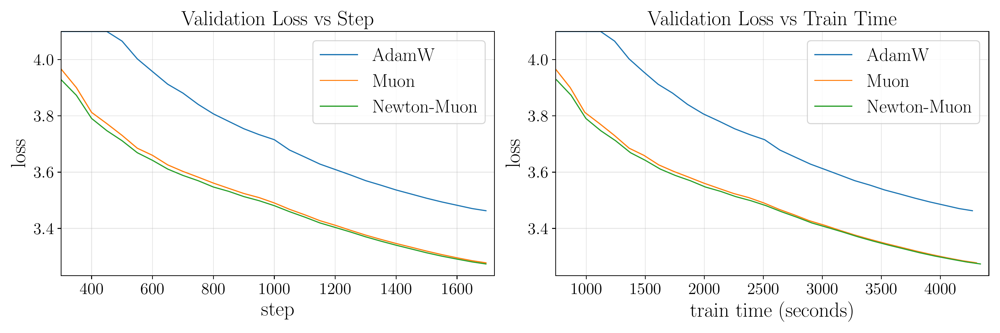

# The Newton-Muon Optimizer

Paper: [arXiv:2604.01472](https://arxiv.org/abs/2604.01472)

This repository is adapted from [modded-nanogpt](https://github.com/KellerJordan/modded-nanogpt). Thanks to Keller Jordan and all contributors.

## What Is Newton-Muon?

Newton-Muon modifies standard Muon by right-preconditioning each layer gradient with an inverse activation second moment before the usual Muon pipeline.



In this codebase, different matrix types are handled as follows:

- Packed attention QKV matrices share one full $d\times d$ activation second-moment estimate across the $Q$, $K$, and $V$ blocks.
- Attention output matrices and MLP expansion matrices use one full $d\times d$ estimate.
- The MLP contraction matrix uses a four-block diagonal approximation: it is split into four $d\times d$ blocks, with four separate second-moment estimates and four separate inverses applied blockwise.

This is the only algorithmic change: standard Muon is applied after the right-preconditioner refresh/apply step.

## Install

```bash
pip install numpy tqdm torch huggingface-hub kernels setuptools typing-extensions
```

## Reproduction harness used in this fork

This fork keeps the upstream optimizer and training scripts intact, and adds
scripts for AIStation GPU2 reproduction under `/huyang2/muon_plus`.

```bash
./setup.sh
./down.sh
./run.sh smoke muon1
./run.sh full muon1
```

Important runtime paths are forced under the repository root:

- `.venv`, `.cache`, `artifacts`, `models`, `runs`
- `data/fineweb10B`

Raw logs, checkpoints, and data are intentionally ignored by git. Each run
creates `runs/<run_id>/metadata.json`, `runs/<run_id>/stdout.log`, and a source
snapshot. The summary is written to `experiments/<run_id>.md` and
`leaderboard.csv` for Git-backed experiment tracking.

The first target baseline is `muon1`, because it is the README's single-GPU
Muon baseline for Newton-Muon-1. The paper reports loss `3.2793` and time
`7314.1s` on a single H100; on GPU2's A100 80GB, loss is the primary comparison
target and wall time is hardware-sensitive.

## Download training data

```bash
python data/cached_fineweb10B.py 50
```

## Newton-Muon-1 (record #4, single H100)

GPU requirement: single GPU with >=80 GB RAM.

Muon baseline code reference:

- [record #4 log](https://github.com/KellerJordan/modded-nanogpt/tree/074a197/records/track_1_short/2024-10-10_Muon)

Note: the following baseline is different from the original record file because Triton kernels were added, but the ML pipeline was not changed.

Run Muon baseline:

```bash
python train_gpt_muon_1.py
```

Run AdamW:

```bash
python train_gpt_adam_1.py
```

Run Newton-Muon:

```bash
python train_gpt_newton_muon_1.py
```

| Method | Loss | Time (s) |
| --- | ---: | ---: |
| AdamW | 3.3801 | 7228.4 |
| Muon | 3.2793 | 7314.1 |
| Newton-Muon | 3.2611 | 7443.3 |



## Newton-Muon-2 (near record #28, single L40S)

GPU requirement: single GPU with compute capability **≥ NVIDIA L40S**.

Muon baseline code reference:

- [train_gpt.py @ 9d9dc96](https://github.com/KellerJordan/modded-nanogpt/blob/9d9dc96/train_gpt.py)

Run Muon baseline:

```bash
torchrun --standalone --nproc_per_node=1 train_gpt_muon_2.py
```

Run AdamW:

```bash
torchrun --standalone --nproc_per_node=1 train_gpt_adam_2.py
```

Run Newton-Muon:

```bash
torchrun --standalone --nproc_per_node=1 train_gpt_newton_muon_2.py
```

Note: the code is designed to run on only **one GPU**, so use `nproc_per_node=1`.

| Method | Run 1 | Run 2 | Run 3 | Run 4 | Avg. loss | Avg. time (s) |
| --- | ---: | ---: | ---: | ---: | ---: | ---: |
| AdamW | 3.4677 | 3.4631 | 3.4640 | 3.4566 | 3.4628 | 4272.0 |
| Muon | 3.2758 | 3.2777 | 3.2783 | 3.2830 | 3.2787 | 4305.9 |
| Newton-Muon | 3.2733 | 3.2736 | 3.2740 | 3.2745 | 3.2739 | 4342.4 |



## Source mapping

`triton_kernels.py` is based on [`triton_kernels.py` @ `71af620`](https://github.com/KellerJordan/modded-nanogpt/blob/71af620/triton_kernels.py).

## Citation

```bibtex
@article{du2026newton,
  title={The {N}ewton-{M}uon optimizer},
  author={Du, Zhehang and Su, Weijie},
  journal={arXiv preprint arXiv:2604.01472},
  year={2026}
}
```
